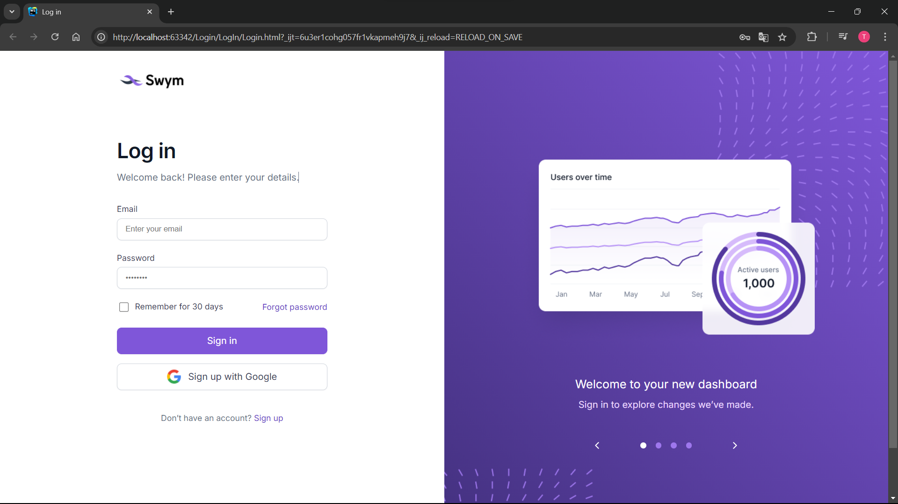
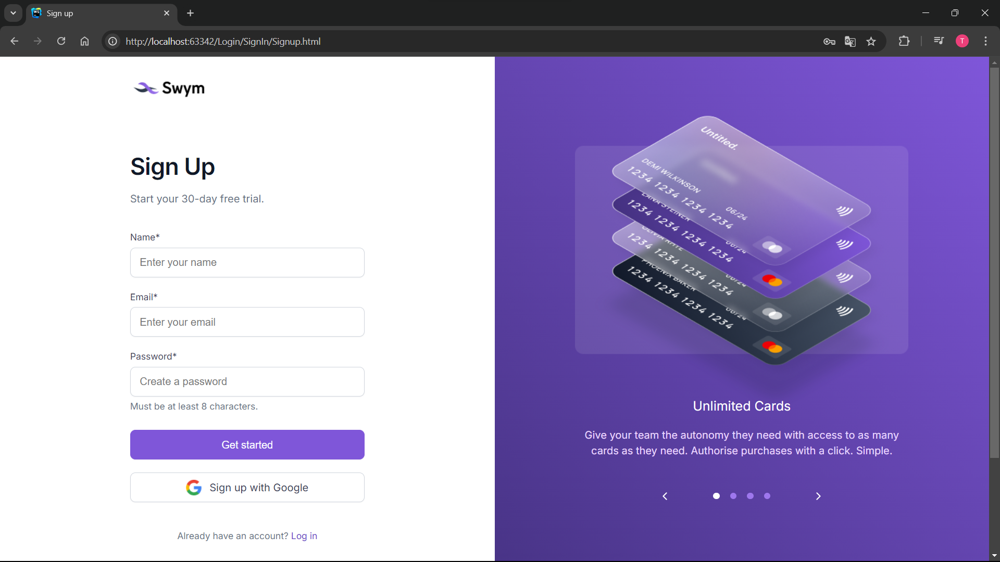

# 💻 Fullstack Project 
Dit project is volledig door mij ontwikkeld tijdens mijn stage waarbij ik zowel de front-end als de back-end heb gebouwd. 
Het ontwerp is geleverd via Figma door mijn werkplekcoach en ik heb dit omgezet naar een werkende applicatie met aandacht op pixel perfecte ontwikelling.

# Screenshots

